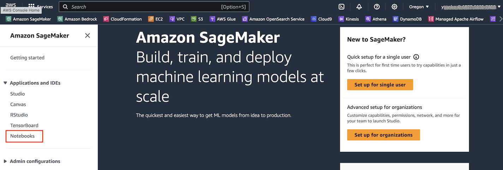
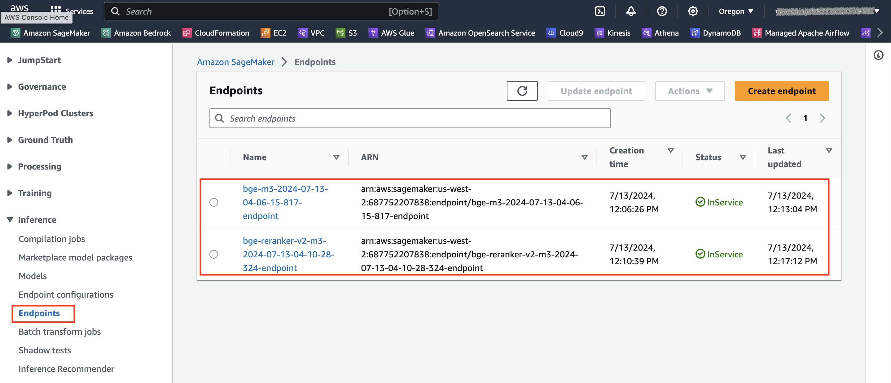
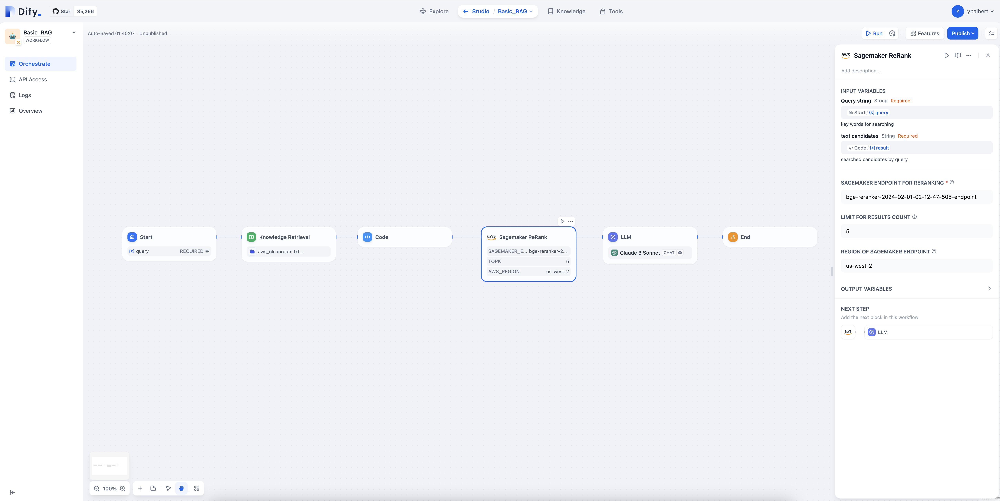
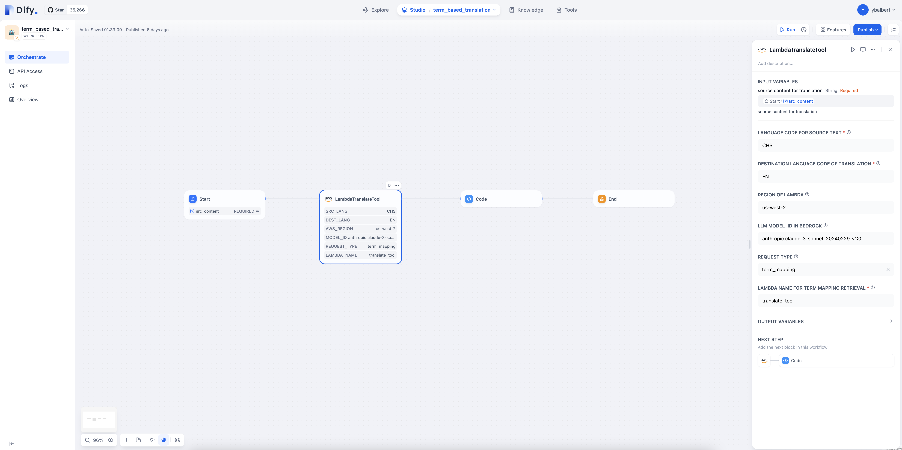

<p align="center">
    &nbsp<strong>简体中文</strong>&nbsp ｜ <a href="README.md"><strong>English</strong></a>&nbsp 
</p>
<br>

# Dify AWS Tools

## 简介
本仓库提供了一些示例代码,展示如何将 SageMaker Provider 和一些基于 AWS 服务的工具集成到 [Dify](https://github.com/langgenius/dify) 中。 

除了参考代码外,您还可以参考 Dify [官方指引](https://docs.dify.ai/guides/tools/quick-tool-integration) 获取更多信息。

## 前置条件

- Dify 环境

- AWS 账户和 AWS 使用经验

- 基本的 Linux 环境使用经验

## 安装方法
```
dify_path=/home/ec2-user/dify
tag=aws

# step1 - 下载代码
git clone https://github.com/aws-samples/dify-aws-tool/

# step2 - 安装代码
mv ./dify-aws-tool/builtin_tools/aws ${dify_path}/api/core/tools/provider/builtin/
mv ./dify-aws-tool/model_provider/sagemaker ${dify_path}/api/core/model_runtime/model_providers/

# step3 - 构建docker镜像
cd ${dify_path}/api
sudo docker build -t dify-api:${tag} .

# step4 - 使用新镜像重启dify
# 修改 ${dify_path}/docker/docker-compose.yaml
# 把 api and worker 服务对应的镜像改成你刚刚构建的新镜像
cd ${dify_path}/docker/
sudo docker compose down
sudo docker compose up -d
```

## 如何部署SageMaker推理端点

如果您想将您的 Embedding/Rerank 模型添加到 Dify Sagemaker Model Provider,您应该首先在 Amazon SageMaker 中自行部署它们。

- 访问 Amazon SageMaker Notebook

    

- 克隆以下 notebooks
    进入终端,然后运行以下脚本
    ```bash
    cd SageMaker/
    # 下载 embedding model
    wget https://raw.githubusercontent.com/aws-samples/dify-aws-tool/main/notebook/bge-embedding-m3-deploy.ipynb
    ## 下载 rerank model
    wget https://raw.githubusercontent.com/aws-samples/dify-aws-tool/main/notebook/bge-reranker-v2-m3-deploy.ipynb
    ```
- 按顺序运行 notebook 的每个Cell
    我们推荐使用 g4dn.xlarge(T4) GPU 用于 embedding 模型和 rerank 模型,同时请注意中国区域和全球区域之间的差异。

- 检查部署出来的推理端点
  
  
  


## 如何在Dify中使用这些工具

- Text Rerank Tool 
    - Deploy the SageMaker endpoint([bge-rerank-m3-v2](https://github.com/aws-samples/dify-aws-tool/blob/main/notebook/bge-reranker-v2-m3-deploy.ipynb))
    - Orchestrate this tool like below snapshot
        
- Term mapping Retrieval Tool (Translation scenario, based on Lambda and Dynamodb)
    - Deploy Repo [[dynamodb-rag](https://github.com/ybalbert001/dynamodb-rag/tree/translate)] 
    - Orchestrate this tool like below snapshot
        
    
## 目标受众
- Dify / AWS 用户
- 生成式 AI 开发者