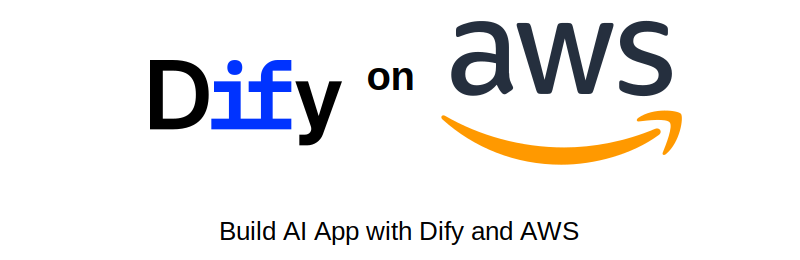

  <a href="https://github.com/aws-samples/dify-aws-tool/blob/main/workflow/README.md">Demos</a> ·
  <a href="https://github.com/aws-samples/dify-aws-tool/blob/main/dify.yaml">Deploy Dify With CloudFormation</a> ·
  <a href="https://github.com/aws-samples/solution-for-deploying-dify-on-aws">Deploy Dify on EKS</a> ·

  
  
  

  
  
  

## 📋 简介

本仓库提供了 [Dify](https://github.com/langgenius/dify) 中亚马逊云 **Bedrock Model Provider**、**SageMaker Model Provider** 以及 **AWS Tools** 三个插件的源码，以及一些相关的 Workflow 和 Demo，供 Dify 用户和 AWS 用户参考借鉴。

## ⚙️ 前置条件

- Dify 环境 (可以通过 AWS Cloudformation 一键部署社区版 - [dify.yaml](./dify.yaml))
  对于生产环境部署, 请参考解决方案样例 [Dify-on-EKS](https://github.com/aws-samples/solution-for-deploying-dify-on-aws)
- AWS 账户和 AWS 使用经验
- 基本的 Linux 环境使用经验

## 🧰 技术资源

#### 工作流 ([Demo页面](./workflow/README.md))

| 名称 | 描述 | 链接 | 依赖 | 负责人 |
|------|------|------|------|------|
| Term_based_translate | 集成了专词映射的翻译工作流 | [DSL](./workflow/term_based_translation_workflow.yml) | Tool(专词映射) | [ybalbert](ybalbert@amazon.com) |
| Code_translate | 不同代码种类之间的翻译工作流 | [DSL](./workflow/claude3_code_translation.yml) | | [binc](binc@amazon.com) |
| Basic_RAG_Sample | 最基础的RAG工作流示例，包含自定义rerank节点 | [DSL](./workflow/basic_rag_sample.yml) | Tool(Rerank) | [ybalbert](ybalbert@amazon.com) |
| Andrewyng/translation-agent | 复刻吴恩达的tranlsate agent | [DSL](./workflow/andrew_translation_agent.yml) | | [ybalbert](ybalbert@amazon.com) |
| rag_based_bot_with_tts | 基于RAG能语音回答的Bot | [DSL](./workflow/rag_based_bot_with_tts.yml) | Tool(TTS) | [ybalbert](ybalbert@amazon.com) |
| s3_rag | 简易的基于S3的RAG, 无需向量库 | [DSL](./workflow/s3_rag.yml) | S3 Operator | [ybalbert](ybalbert@amazon.com) |
| Marketing-copywriter | 营销文案一条龙 | [DSL](./workflow/marketing-copywriting.yml) | | [Lyson Ober](https://www.youtube.com/@lysonober) |
| Simple_Kimi | 简易自制Kimi | [DSL](./workflow/simple_kimi.yml) | | [ybalbert](ybalbert@amazon.com) |
| SVG_Designer | SVG 图标设计师 | [DSL](./workflow/svg_designer.yml) | | [李继刚](https://waytoagi.feishu.cn/wiki/TRlTwxCFJis292kNAzEc9D4BnvY) |
| Education_Question_Gen | 教育场景 - 试题生成器 | [DSL](./workflow/edu_question_gen.yml) | | [chuanxie](chuanxie@amazon.com) |
| Apply_guardrails | 应用安全防范的聊天工作流 | [DSL](./workflow/apply_guardrails.yml) | | [amyli](amyli@amazon.com) |
| LLM-Finetuning-Dataflow | LLM微调数据合成工作流 | [DSL](./workflow/LLM-Finetuning-Dataflow-dify) | [finetuning-on-aws](https://github.com/tsaol/finetuning-on-aws/tree/main) | [caoliuh](caoliuh@amazon.com) |
| Image/Video Generation Workflow | 基于Amazon Nova Canvas和Reel生成图片和视频 | [DSL](./workflow/generate_image_video.yml) | | [alexwuu](alexwuu@amazon.com) |
| EKS Upgrade Planning | 采集EKS集群信息并生成EKS集群升级计划 | [DSL](./workflow/eks_upgrade_planning/eks_upgrade_planning.yml) | | [wxyan](wxyan@amazon.com) |
| Bedrock based ChatBot for Nextcloud | 基于Amazon S3 + Bedrock Knowledgebase+Nova Pro的智能网盘 | [DSL](./workflow/rag_based_chatbot_for_nextcloud.yml) | | [tanzhuaz](tanzhuaz@amazon.com) |
| ASR_Transcribe | 语音转录文字 | [DSL](./workflow/ASR_Transcribe.yml) | | [ybalbert](ybalbert@amazon.com) |
| Image(Text)-2-Image Search | 文搜图 & 图搜图 | [DSL](./workflow/opensearch_img_search.yml) | OpenSearch Knn Retriever | [ybalbert](ybalbert@amazon.com) |
| MCP Server 集成  | MCP Server 集成演示 | [DSL](./workflow/mcp_server_integration.yml) |  | [ybalbert](ybalbert@amazon.com) |

> 💡 更多工作流可以关注社区网站：[dify101.com](https://dify101.com/)、[difyshare.com](https://difyshare.com/)、[Awesome-Dify-Workflow](https://github.com/svcvit/Awesome-Dify-Workflow)

#### 扩展工具

| 工具名称 | 工具类型 | 描述 | 部署文档 | 负责人 |
|---------|---------|------|---------|-------|
| Rerank | PAAS | 文本相似性排序 | [Notebook](https://github.com/aws-samples/dify-aws-tool/blob/main/notebook/bge-reranker-v2-m3-deploy.ipynb) | [ybalbert](ybalbert@amazon.com) |
| TTS | PAAS | 语音合成 | [Code](https://github.com/aws-samples/dify-aws-tool/tree/main/notebook/cosyvoice) | [ybalbert](ybalbert@amazon.com) |
| Bedrock Guardrails | SAAS | 文本审核工具，通过 Amazon Bedrock Guardrail 上提供的独立评估API ApplyGuardrail 来实现 | | [amyli](amyli@amazon.com) |
| Term_multilingual_mapping | PAAS | 切词/获取专词映射 | [Repo](https://github.com/ybalbert001/dynamodb-rag/tree/translate) | [ybalbert](ybalbert@amazon.com) |
| Image Translation Tool | PAAS | 翻译图片上的文字 | Coming | [tangqy](tangqy@amazon.com) |
| Chinese Toxicity Detector | PAAS | 中文有害内容检测 | Coming | [ychchen](ychchen@amazon.com) |
| Transcribe Tool | SAAS | AWS transcribe service tool (ASR) | | [river xie](chuanxie@amazon.com) |
| Bedrock Retriever | PAAS | Amazon Bedrock知识库检索工具 | | [ychchen](ychchen@amazon.com) |
| S3 Operator | SAAS | 读写S3中bucket的内容，可以返回presignURL | | [ybalbert](ybalbert@amazon.com) |
| AWS Bedrock Nova Canvas | SAAS | 基于Amazon Nova Canvas生成图像 | | [alexwuu](alexwuu@amazon.com) |
| AWS Bedrock Nova Reel | SAAS | 基于Amazon Nova Reel生成视频 | | [alexwuu](alexwuu@amazon.com) |
| OpenSearch Knn Retriever | PAAS | 用KNN方法从OpenSearch召回数据 | [Notebook](https://github.com/aws-samples/dify-aws-tool/tree/main/notebook/search_img_by_img) | [ybalbert](ybalbert@amazon.com) |
| Frame Extractor | PAAS | 对GIF输入抽帧作为LLM输入 |  | [ybalbert](ybalbert@amazon.com) |

#### 模型提供商

| 模型名称 | 模型类型 | 部署文档 | 负责人 |
|---------|---------|---------|-------|
| 任何开源大语言模型 | SageMaker\LLM | [Model_hub](https://github.com/aws-samples/llm_model_hub) | [ybalbert](ybalbert@amazon.com) |
| Bge-m3-rerank-v2 | SageMaker\Rerank | [Notebook](https://github.com/aws-samples/dify-aws-tool/blob/main/notebook/bge-reranker-v2-m3-deploy.ipynb) | [ybalbert](ybalbert@amazon.com) |
| Bge-embedding-m3 | SageMaker\Embedding | [Notebook](https://github.com/aws-samples/dify-aws-tool/blob/main/notebook/bge-embedding-m3-deploy.ipynb) | [ybalbert](ybalbert@amazon.com) |
| CosyVoice | SageMaker\TTS | [Code](https://github.com/aws-samples/dify-aws-tool/tree/main/notebook/cosyvoice) | [ybalbert](ybalbert@amazon.com) |
| SenseVoice | SageMaker\ASR | [Notebook](https://github.com/aws-samples/dify-aws-tool/blob/main/notebook/funasr-deploy.ipynb) | [ybalbert](ybalbert@amazon.com) |
| Whisper-large-v3-turbo | SageMaker\ASR | [Notebook](https://github.com/aws-samples/dify-aws-tool/blob/main/notebook/whisper-deploy-china-region.ipynb) | [ybalbert](ybalbert@amazon.com) |

> **📌 重要提示**
>
> Dify的SageMaker LLM Provider 可以支持大多数开源模型。我们建议您使用 [Model_hub](https://github.com/aws-samples/llm_model_hub) 来部署这些模型。它非常简单易用，支持无代码方式进行模型微调和部署。如果您不想安装 [Model_hub](https://github.com/aws-samples/llm_model_hub)，也可以参考[指引](https://github.com/aws-samples/dify-aws-tool/tree/main/notebook/llm_sagemaker_deploy)通过vllm的方式部署LLM到SageMaker。
>
> 如果您想将您的 Embedding/Rerank/ASR/TTS 模型添加到Dify Sagemaker Model Provider，您应该首先在 Amazon SageMaker 中自行部署它们。请参见对应的[notebook](https://github.com/aws-samples/dify-aws-tool/tree/main/notebook)去部署。

## 🔧 使用须知

#### 寻求帮助

- 在仓库Issue页面提出问题

- 到内部飞书群咨询

   

#### 贡献方式

- Fork本仓库，发Merge Request
- 修改README.md，在表格中添加你的工作（如workflow或者Tool）

## 📚 其他材料

#### 演示视频

- [Dify 1.0.0发布 & AWS插件适配](https://aws.highspot.com/items/67c2e250ac191e72528d176d?lfrm=rhp.0)
- [如何在Dify上使用AWS中的DeepSeek模型？仅5分钟](https://mp.weixin.qq.com/s/psY6m9xUNce4QIyksKvapg)
- [Dify与Model Hub集成实现主流开源模型](https://mp.weixin.qq.com/s/t023tUS7QGb9CzFK40YVYw)
- [Dify 原生内容审查扩展API调用 Bedrock Guardrail构建负责任的AI应用](https://amazon.awsapps.com/workdocs-preview/index.html#/document/1c6e65aa34790cbcbdd74871369ca1b079f2eb5a3d044d614c6cf4f622f56468)
- [三步构建基于最新Bedrock C3.5-V2的Kimi](https://mp.weixin.qq.com/s/_2obKrn849a6jOxML_8Btw)
- [AWS服务作为工具集成到Dify](https://mp.weixin.qq.com/s/ZZK4Qh0kcnlZHIdO82nVZA)
- [Dify与SageMaker上的ASR/TTS集成](https://mp.weixin.qq.com/s/g2aey251YPk-tekL1uc_nw)
- [如何在Dify中使用bedrock inference profile]（https://github.com/user-attachments/assets/938e879a-b7dd-44e5-a096-4c22f67b319b）

#### 相关Blog/文档

- [通过API 扩展在 Dify 上使用 Amazon Bedrock Guardrail 给聊天应用增加内容审查安全护栏](https://amzn-chn.feishu.cn/docx/PhNbdiDRDoj8vlxIDjAcKBlVncb)
- [集成Dify和AWS Service实现更具灵活性的翻译工作流](https://br5879sdns.feishu.cn/docx/Osehd7t5ZocVocxhtQycBHDCnfb)
- [在Dify上使用AWS中的DeepSeek 模型](https://amzn-chn.feishu.cn/docx/BtLHdxaG5o9xL6xXZcyciZUCn0f)

#### 动手实验

- [Rapidly Build GenAI Apps with Dify](https://catalog.us-east-1.prod.workshops.aws/workshops/2c19fcb1-1f1c-4f52-b759-0ca4d2ae2522/zh-CN)
- [硅基流动+DeepSeek+Dify workshop](https://catalog.us-east-1.prod.workshops.aws/workshops/87e070e2-5621-4c94-9285-529514ec4454/en-US)