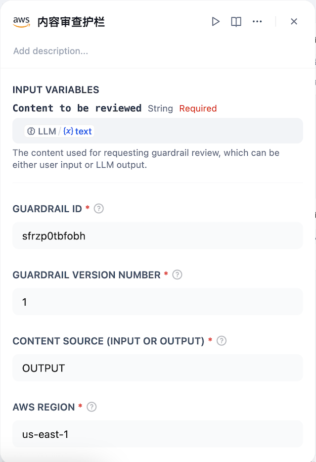

## AWS Tools

**Author:** aws  
**Type:** Tool

## Overview | 概述

The AWS Tools plugin provides a comprehensive set of tools based on various AWS services, enabling you to leverage AWS capabilities directly within your Dify applications. These tools cover a wide range of functionalities including content moderation, text reranking, text-to-speech conversion, speech recognition, and more.

The AWS Tools plugin includes the following tools:
- Apply Guardrail
- Bedrock Retrieve
- Bedrock Retrieve and Generate
- Lambda Translate Utils
- Lambda YAML to JSON
- Nova Canvas
- Nova Reel
- S3 Operator
- SageMaker Chinese Toxicity Detector
- SageMaker Text Rerank
- SageMaker TTS
- Transcribe ASR

AWS Tools 插件提供了一套基于各种 AWS 服务的综合工具集，使您能够在 Dify 应用程序中直接利用 AWS 功能。这些工具涵盖了广泛的功能，包括内容审核、文本重排序、文本转语音转换、语音识别等。

AWS Tools 插件包含以下工具：
- 应用护栏
- Bedrock 检索
- Bedrock 检索和生成
- Lambda 翻译工具
- Lambda YAML 转 JSON
- Nova 画布
- Nova 卷轴
- S3 操作器
- SageMaker 中文毒性检测器
- SageMaker 文本重排序
- SageMaker 文本转语音
- Transcribe 自动语音识别

## Configure | 配置

AWS Tools generally do not obtain authorization by configuring AK/SK through the Dify interface. Typically, authorization can be obtained by binding an AWS IAM Role to the Dify environment, or by setting AK/SK in the environment (EC2/EKS).

AWS Tools 一般不通过在Dify的界面上配置AK/SK来获取授权，一般可以通过Dify环境绑定AWS IAM Role，或者在环境(Ec2/EKS)中设置AK/SK。

The AWS Tool interface is generally used to configure some tool call parameters, as shown in the following image.

AWS Tool的界面一般用于配置一些工具的调用参数，如下图

## Issue Feedback | 问题反馈

For more detailed information, please refer to [aws-sample/dify-aws-tool](https://github.com/aws-samples/dify-aws-tool/), which contains multiple workflows for reference.
If you have issues that need feedback, feel free to raise questions or look for answers in the [Issue](https://github.com/aws-samples/dify-aws-tool/issues) section.

更多详细信息可以参考 [aws-sample/dify-aws-tool](https://github.com/aws-samples/dify-aws-tool/)，其中包含多个 workflow 供参考。
如果存在问题需要反馈，欢迎到 [Issue](https://github.com/aws-samples/dify-aws-tool/issues) 去提出问题或者寻找答案。
