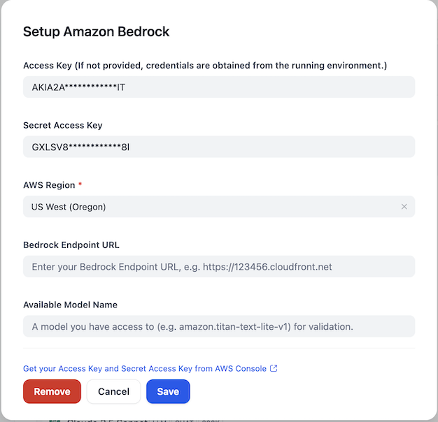

## Amazon Bedrock

**Author:** aws  
**Type:** Model Provider

## Overview | 概述

The [Amazon Bedrock](https://aws.amazon.com/bedrock/) is a fully managed service that offers a choice of high-performing foundation models (FMs) from leading AI companies like AI21 Labs, Anthropic, Cohere, Meta, Stability AI, and Amazon with a single API. With Amazon Bedrock, you can easily experiment with and evaluate top FMs for your use case, privately customize them with your data using techniques such as Retrieval Augmented Generation (RAG) and Fine-tuning, and build agents that execute tasks using your enterprise systems and data sources.

Amazon Bedrock supports various model types:
- LLM (Large Language Models)
- Text Embedding
- Rerank

[Amazon Bedrock](https://aws.amazon.com/bedrock/) 是一项完全托管的服务，通过单一 API 提供来自 AI21 Labs、Anthropic、Cohere、Meta、Stability AI 和亚马逊等领先 AI 公司的高性能基础模型 (FMs)。使用 Amazon Bedrock，您可以轻松地为您的用例试验和评估顶级基础模型，使用检索增强生成 (RAG) 和微调等技术私密地用您的数据进行定制，并构建能够使用您的企业系统和数据源执行任务的代理。

Amazon Bedrock 支持多种模型类型：
- LLM（大型语言模型）
- 文本嵌入
- 重排序

## Configure | 配置

After installing the plugin, configure the Amazon Bedrock credentials within the Model Provider settings. You'll need to provide your AWS Access Key, Secret Access Key, and select the appropriate AWS Region. You can also specify a Bedrock Endpoint URL if needed. For validation purposes, you can provide an available model name that you have access to (e.g., amazon.titan-text-lite-v1).

安装插件后，在模型提供商设置中配置 Amazon Bedrock 凭证。您需要提供 AWS Access Key、Secret Access Key 并选择适当的 AWS 区域。如果需要，您还可以指定 Bedrock 端点 URL。为了进行验证，您可以提供一个您有权访问的可用模型名称（例如：amazon.titan-text-lite-v1）。

## Issue Feedback | 问题反馈

For more detailed information, please refer to [aws-sample/dify-aws-tool](https://github.com/aws-samples/dify-aws-tool/), which contains multiple workflows for reference.

更多详细信息可以参考 [aws-sample/dify-aws-tool](https://github.com/aws-samples/dify-aws-tool/)，其中包含多个 workflow 供参考。

If you have issues that need feedback, feel free to raise questions or look for answers in the [Issue](https://github.com/aws-samples/dify-aws-tool/issues) section.

如果存在问题需要反馈，欢迎到 [Issue](https://github.com/aws-samples/dify-aws-tool/issues) 去提出问题或者寻找答案。
