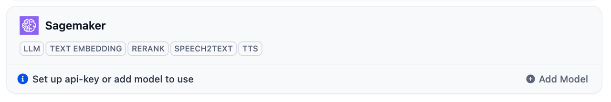
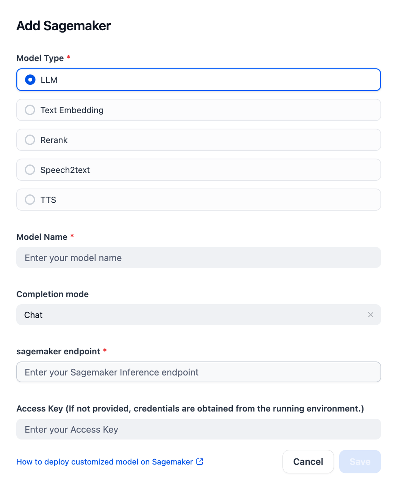

## Amazon Sagemaker

**Author:** aws  
**Type:** Model Provider


## Overview | 概述

The [Amazon Sagemaker](https://aws.amazon.com/sagemaker/) is a fully managed service that brings together a broad set of tools to enable high-performance, low-cost ML for any use case. With SageMaker AI, you can build, train and deploy ML models at scale using tools like notebooks, debuggers, profilers, pipelines, MLOps, and more – all in one integrated development environment (IDE).

[Amazon Sagemaker](https://aws.amazon.com/sagemaker/) 是一项完全托管的服务，它汇集了广泛的工具集，为任何用例提供高性能、低成本的机器学习能力。通过 SageMaker AI，您可以使用笔记本、调试器、性能分析器、管道、MLOps 等工具在一个集成开发环境 (IDE) 中大规模构建、训练和部署机器学习模型。


## Configure | 配置

After installing the plugin, configure the Sagemaker endpoint url within the Model Provider settings. Obtain your endpoint url from [here](https://console.aws.amazon.com/console/home?nc2=h_ct&src=header-signin). Once saved, you can begin using Sagemaker to build your AI agents and agentic workflows.

安装插件后，在模型提供商设置中配置 Sagemaker 端点 URL。您可以从[这里](https://console.aws.amazon.com/console/home?nc2=h_ct&src=header-signin)获取端点 URL。保存后，您就可以开始使用 Sagemaker 构建 AI 代理和代理工作流。



You could add model through the `settings -> model provider -> Sagemaker` page.

您可以通过 `设置 -> 模型提供商 -> Sagemaker` 页面添加模型。



## Cross-Account Access with AssumeRole | 使用 AssumeRole 进行跨账户访问

The SageMaker plugin supports cross-account access using AWS AssumeRole functionality. This allows you to access SageMaker endpoints deployed in different AWS accounts while maintaining security best practices.

SageMaker 插件支持使用 AWS AssumeRole 功能进行跨账户访问。这允许您访问部署在不同 AWS 账户中的 SageMaker 端点，同时保持安全最佳实践。

### When to Use AssumeRole | 何时使用 AssumeRole

- **Multi-account architecture**: When your SageMaker endpoints are in a different AWS account than your Dify deployment
- **Enhanced security**: Use temporary credentials instead of long-term access keys
- **Enterprise environments**: Meet compliance requirements for cross-account resource access
- **DevOps workflows**: Separate development, testing, and production environments across accounts

- **多账户架构**：当您的 SageMaker 端点与 Dify 部署位于不同的 AWS 账户中时
- **增强安全性**：使用临时凭证而不是长期访问密钥
- **企业环境**：满足跨账户资源访问的合规要求
- **DevOps 工作流**：在不同账户中分离开发、测试和生产环境

### Setup Instructions | 设置说明

#### 1. Create IAM Role in Target Account | 在目标账户中创建 IAM 角色

In the AWS account where your SageMaker endpoint is deployed:

在部署 SageMaker 端点的 AWS 账户中：

```json
{
    "Version": "2012-10-17",
    "Statement": [
        {
            "Effect": "Allow",
            "Action": [
                "sagemaker:InvokeEndpoint",
                "sagemaker:DescribeEndpoint"
            ],
            "Resource": "arn:aws:sagemaker:*:*:endpoint/*"
        }
    ]
}
```

#### 2. Configure Trust Relationship | 配置信任关系

Set up the trust policy to allow the source account to assume this role:

设置信任策略以允许源账户承担此角色：

```json
{
    "Version": "2012-10-17",
    "Statement": [
        {
            "Effect": "Allow",
            "Principal": {
                "AWS": "arn:aws:iam::SOURCE-ACCOUNT-ID:root"
            },
            "Action": "sts:AssumeRole",
            "Condition": {
                "StringEquals": {
                    "sts:ExternalId": "optional-external-id"
                }
            }
        }
    ]
}
```

#### 3. Grant AssumeRole Permission in Source Account | 在源账户中授予 AssumeRole 权限

In your Dify deployment account, ensure the IAM user/role has permission to assume the target role:

在您的 Dify 部署账户中，确保 IAM 用户/角色有权限承担目标角色：

```json
{
    "Version": "2012-10-17",
    "Statement": [
        {
            "Effect": "Allow",
            "Action": "sts:AssumeRole",
            "Resource": "arn:aws:iam::TARGET-ACCOUNT-ID:role/SageMakerCrossAccountRole"
        }
    ]
}
```

#### 4. Configure in Dify | 在 Dify 中配置

When adding a SageMaker model in Dify, fill in the **Assume Role ARN** field:

在 Dify 中添加 SageMaker 模型时，填写 **跨账户角色ARN** 字段：

```
arn:aws:iam::TARGET-ACCOUNT-ID:role/SageMakerCrossAccountRole
```

### Configuration Options | 配置选项

| Field | Required | Description |
|-------|----------|-------------|
| **Access Key** | Optional | Source account credentials (can use IAM role instead) |
| **Secret Access Key** | Optional | Source account credentials (can use IAM role instead) |
| **Assume Role ARN** | Optional | Target account role ARN for cross-account access |
| **AWS Region** | Required | Region where the SageMaker endpoint is deployed |
| **SageMaker Endpoint** | Required | The endpoint name to invoke |

| 字段 | 必填 | 描述 |
|------|------|------|
| **Access Key** | 可选 | 源账户凭证（可以使用 IAM 角色代替） |
| **Secret Access Key** | 可选 | 源账户凭证（可以使用 IAM 角色代替） |
| **跨账户角色ARN** | 可选 | 用于跨账户访问的目标账户角色 ARN |
| **AWS 地区** | 必填 | 部署 SageMaker 端点的地区 |
| **SageMaker 端点** | 必填 | 要调用的端点名称 |

### Security Best Practices | 安全最佳实践

- **Principle of least privilege**: Grant only the minimum permissions required
- **Use external IDs**: Add external ID conditions for additional security
- **Monitor access**: Use CloudTrail to monitor cross-account access
- **Rotate credentials**: Temporary credentials are automatically rotated
- **Network security**: Consider VPC endpoints for private connectivity

- **最小权限原则**：仅授予所需的最小权限
- **使用外部 ID**：添加外部 ID 条件以增强安全性
- **监控访问**：使用 CloudTrail 监控跨账户访问
- **轮换凭证**：临时凭证会自动轮换
- **网络安全**：考虑使用 VPC 端点进行私有连接

### Troubleshooting | 故障排除

**Common Issues:**

- **Access Denied**: Check IAM permissions and trust relationships
- **Invalid ARN**: Verify the role ARN format and account ID
- **Region Mismatch**: Ensure the region matches your SageMaker endpoint
- **Endpoint Not Found**: Verify the endpoint name and deployment status

**常见问题：**

- **访问被拒绝**：检查 IAM 权限和信任关系
- **无效的 ARN**：验证角色 ARN 格式和账户 ID
- **地区不匹配**：确保地区与您的 SageMaker 端点匹配
- **端点未找到**：验证端点名称和部署状态

## Examples & Feedback | 示例 & 反馈

For more detailed information, please refer to [aws-sample/dify-aws-tool](https://github.com/aws-samples/dify-aws-tool/), which contains multiple workflows for reference.

If you have issues that need feedback, feel free to raise questions or look for answers in the [Issue](https://github.com/aws-samples/dify-aws-tool/issues) section.

更多详细信息可以参考 [aws-sample/dify-aws-tool](https://github.com/aws-samples/dify-aws-tool/)，其中包含多个 workflow 供参考。

如果存在问题需要反馈，欢迎到 [Issue](https://github.com/aws-samples/dify-aws-tool/issues) 去提出问题或者寻找答案。
