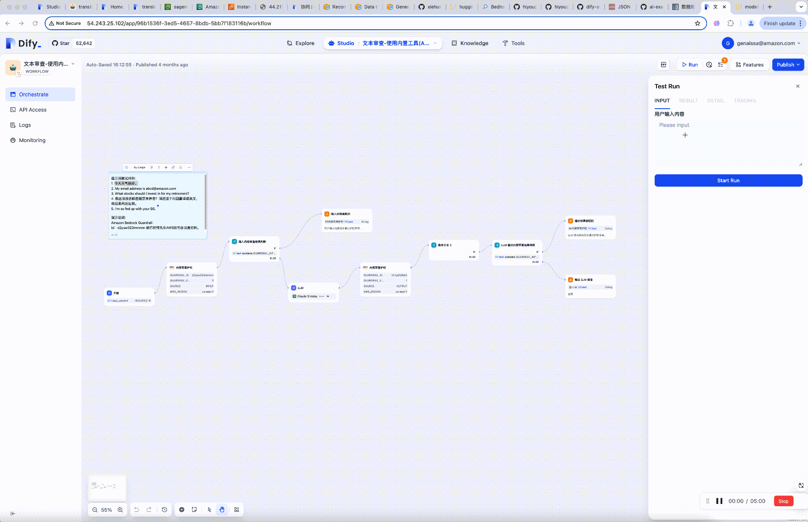
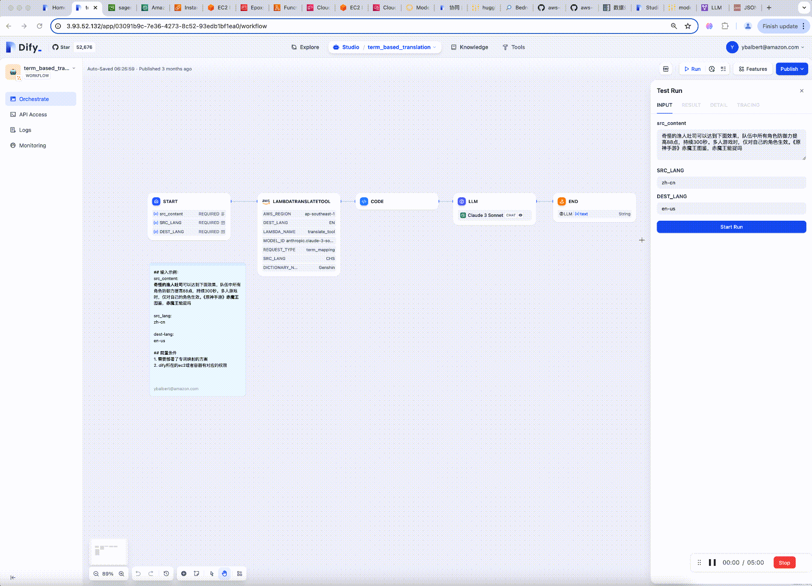

## Workflow Demo List

<table>
  <tr>
    <th>simple_kimi</th>
  </tr>
  <tr>
    <td></td>
  </tr>
  <tr>
    <th>svg designer</th>
  </tr>
  <tr>
    <td></td>
  </tr>
  <tr>
    <th>translation check</th>
  </tr>
  <tr>
    <td></td>
  </tr>
  <tr>
    <th>Guardrails</th>
  </tr>
  <tr>
    <td></td>
  </tr>
  <tr>
    <th>Edu:Question Generation</th>
  </tr>
  <tr>
    <td></td>
  </tr>
  <tr>
    <th>Term Based Translation</th>
  </tr>
  <tr>
    <td></td>
  </tr>
  <tr>
    <th>Code Translation</th>
  </tr>
  <tr>
    <td></td>
  </tr>
</table>
